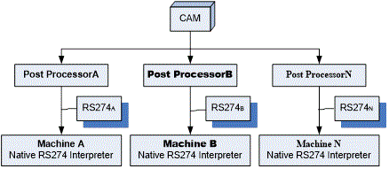
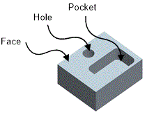
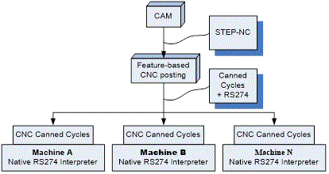
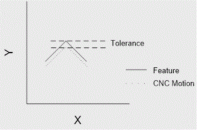
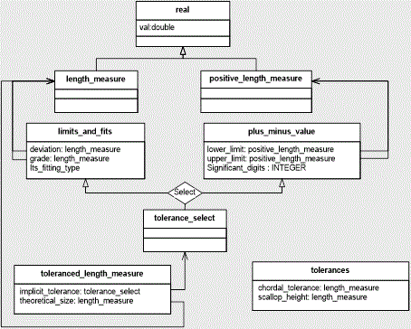
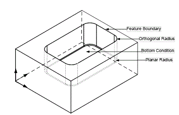
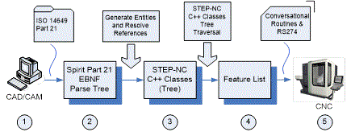
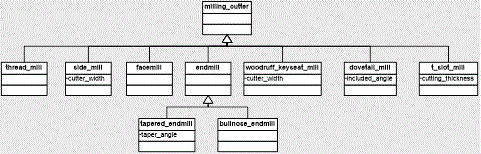
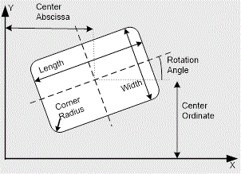
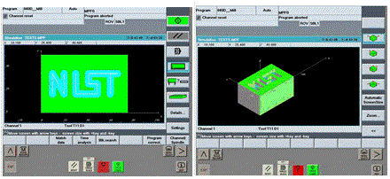

**##**
**STEPNC++ - An Effective Tool for Feature-based CAM/CNC** 

John Michaloski1, Thomas Kramer2, Frederick Proctor3, Xun Xu4, Sid Venkatesh5, and David Odendahl6

1-3 Intelligent Systems Division, MS8230, National Institute of Standards and Technology

100 Bureau Drive, Gaithersburg, MD 20899, USA

Email: 1 john.michaloski@nist.gov, 2 thomas.kramer@nist.gov, 3 frederick.proctor@nist.gov,

4 Department of Mechanical Engineering, University of Auckland, 

20 Symonds Street, Auckland, New Zealand

Email: x.xu@auckland.ac.nz

5,6  Boeing Aircraft, Seattle, WA

Email: 5 sid.venkatesh@boeing.com, 6 david.j.odendahl@boeing.com

**Abstract**

This chapter discusses the realization of direct translation of feature-based CAM into feature-based CNC part program files.  The information infrastructure that allows this to happen is STEP-NC, as described by ISO 14649 Parts 10 and 11.  Among the many benefits cited for STEP-NC, the elimination of the costly and inefficient process of post-processing using one standard CNC definition is most commonly cited.  However, this chapter argues a much greater benefit can be found using STEP-NC to resolve the CAM/CNC impedance mismatch where CAM comprehensive process information is reduced into motion primitives.  The CAM/CNC impedance mismatch and resulting lack of process information make intelligent machining difficult.  Given this perspective, a demonstration system was developed to show that feature-based CNC is possible with STEP-NC, which preserves more feature-based CAM process knowledge to make intelligent machining possible. The demonstration system incorporates:  1) part representation using STEP-NC Part 21 files, 2) reading and analyzing feature-based elements of the STEP-NC, 3) translation into a CNC feature-based representation, and 4) generation of actual CNC programs relying on conversational programming "Canned Cycles".  Cutting and simulation tests have confirmed the advantages of the approach.  Overall, the demonstration system shows a standard information infrastructure such as STEP-NC is essential for advancing manufacturing to enable improvements in efficiency, product quality, life-cycle cost, and time-to-market.

# ##.1 Introduction 

In design and manufacturing, organizations depend on information technology to handle the tasks necessary to make products. Over the last two decades, Computer-Aided Design (CAD) and Computer-Aided Manufacturing (CAM) information technology has greatly benefitted manufacturing industries everywhere. CAD/CAM benefits include cost-savings, more rapid and improved designs, higher productivity and better return on investment. Today, it is commonplace to see complex manufacturing done with global CAD/CAM collaboration and virtualization that includes numerous partners located locally and internationally, from the same and different companies, scattered throughout the world.  This globalization vision for manufacturing has resulted in streamlined supplier chains, optimized resources, and distributed collaborative design. 

Nevertheless, despite the positive contributions of CAD/CAM to the design and manufacturing processes, barriers still exist for achieving seamless end-to-end manufacturing.  Sharing product information throughout the job stream within the entire manufacturing life-cycle is still a major problem. A key contributor to the loss of information within production is the lack of a product exchange standard. The "Interoperability Cost Analysis of the U.S. Automotive Supply Chain" study performed by the Research Triangle and commissioned by NIST estimates that imperfect interoperability imposes at least $1 billion per year on the members of the U.S. automotive supply chain [##.1].  Most significant, are the costs of repairing or reentering of non-standard upstream design product data files that are not usable for downstream production applications.  Additionally, reentering and/or reformatting information results in duplication of the data, which can introduce substantial semantic problems maintaining consistent values between two different copies of the same information. Duplicate representation requires more manpower and computational costs and often important information can be lost during translation. A similar problem in data base technology is known as the impedance mismatch.  In electronics, impedance mismatch is intended to describe the mismatch between output and input signals, but has been borrowed by the software community to describe a mismatch between incompatible software technologies. 

STEP-NC, as defined by ISO 14649 [##.2][##.3] or ISO 10303-AP238 [##.4], attempts to ameliorate the productivity losses due to the impedance mismatch between the CAM machining specification and the actual CNC machining.  STEP-NC is the colloquial term that refers to both ISO 14649 and ISO 10303-AP238, where ISO 14649 is the Application Reference Model (ARM) schema, and  ISO 10303 AP238, is the reinterpretation of ISO 14649 into the fully-integrated Application Integrated Model (AIM) schema. In this chapter, STEP-NC will refer to the ISO 14649 family of machining standards.

STEP-NC offers accurate and complete product definition data from product design all the way to the machine tool.  Current discrete part manufacturing does not produce parts based on all the product information that has been described upstream by the design process. Instead, the part fabrication process starts with the CAD part design, incorporates CAM feature-based machining operations, are then translates the machining operations into simple machine tool motion primitives, or, "M" and "G" codes. Consequently, much of the important design and fabrication knowledge is lost and the machine tool has little knowledge to work with regarding the part features, operations or resources  used necessary to optimize and safeguard the machining.  This loss of process knowledge is clearly detrimental, as today's machine tool CNCs have the capability to synthesize many more aspects of the machining process in order to realize intelligent control.

This chapter describes STEPNC++, an open-source, software package for translating feature-based STEP-NC CAM files into feature-based CNC programs in a portable, standard manner. Key to improving this translation is the minimizing whenever possible the use of CNC primitive motion tool-paths. Two critical information infrastructure technologies made featured-based CAM/CNC possible –   STEP-NC and C++ meta-programming techniques.  For the metal working industries, STEP-NC offers a variety of feature-rich machining specifications that can be used for sharing part design and process data up/downstream within the manufacturing process.  Recent advances in C++ compilers have made meta-programming templates, which can be thought of as compile-time execution, a powerful technology in generating succinct but powerful code.

# ##.2 Feature-based CAM to Feature-based CNC

Conceptually, computer integrated manufacturing (CIM) is a production model by which all elements of the factory (i.e., people, equipment, materials, and computers) are organized and integrated around common data repositories. Figure **##.1** shows the CIM sequence of production stages, commonly referred to as "Art to Part", within a modern manufacturing process for producing parts. In spite of CIM advances, from the perspective of Computer Aided Engineering (CAE), CAD systems, CAM systems, and CNC machines, the process still requires better data integration at all levels and along multiple dimensions (design, analysis, process planning, fabrication) of the manufacturing enterprise.

**Figure ##.1** Computer Integrated Manufacturing Art to Part Production

The goal of "Art to Part'" is to manufacture high quality products in the most cost-efficient manner. Initially, the "Art" stage involves an idea or customer need for a discrete part. The CAD stage uses software packages and solid modellers to design the part geometry and tolerances in a concurrent engineering environment that incorporates part intent, and relationships such as mating, geometric fit or assembly. CAE analysis studies the related parts for structural weakness with regard to loads, strains, and stresses.  The CAM macro stage accepts a CAD geometrical part definition and produces a process plan applying software-derived or domain expert's manufacturing knowledge.  The CAM micro stage produces a detailed manufacturing NC process plan including NC code that is verified in simulation prior to manufacturing.  

On the shop floor, the machining stage uses a machine tool to cut a metal casting or raw stock to create the "Part". A CNC computer directs the machining operations.  The machining stage employs a CNC machine tool with sufficient accuracy and precision to meet part tolerances and associates the necessary raw stock or casted material, fixtures and tooling as identified in the detailed manufacturing process plan. The CNC runs a "Part Program" that is a sequence of CNC operations to machine the part.  

In today's art-to-part process, most CNC part programs are generated by CAM modelling software systems.  However, due to inadequate integration, CAM files cannot run natively on any given CNC machine tool, and so require a translation process.  This CAM to CNC translation is known as post processing, which has traditionally been the principal means of translating CAM files into CNC programs.  Post processing takes the CAM feature-based operations and generates a machining part program, not as a list of features and operations, but as ISO 6983/RS274D [##.5][##.6], or "M & G" code motion primitives – lines or arcs.   Henceforth, this chapter will use the legacy RS274 standard when referring to "M & G" motion.

Unfortunately, CNC vendors have augmented and extended the RS274 programming languages as they have seen fit to meet functional needs and user requirements. The proliferation of modifications to the standard has led to hundreds of vastly different RS274 dialects. Consequently, CAM software vendors maintain hundreds of CNC-specific post-processors to provide some form of interoperability. Figure **##.2** outlines the generation of a legacy machine part program, where CAM software, using a different Post-Processor per machine, converts the CAD part models into the required motion-based RS274 NC part program.

**Figure ##.2** Post processing

Post-processing leads to productivity losses due to the impedance mismatch of the process knowledge between the CAM system and the CNC machine. Presently, most CNC machines receive RS274 data defining each axis movement as motion primitives in order to manufacture a part. This geometric data is referred to as machine control data (MCD). MCD provides a very low level of instruction: tool, axes positions, feed, and speed. The problem with MCD programs is that they are not portable or adaptable. Portability is a problem in five axis milling, since unique axes-position data must be generated for each machine control combination (part, tool, and machine configuration) on which the part is to be run [##.7]. Adaptability is a problem because feature-based information is not provided to allow adaptive real-time servo changes in machining dynamics (feed and speeds) based on machining conditions. Overall, the CAM-CNC post processing has discarded all of the feature-based part and process information that could help yield higher quality parts faster. 

A shift to feature-based CNC provides a new opportunity for manufacturers to streamline the entire "Art to Part" process, by directly mapping a feature-based CAM file into a feature-based CNC program. The term "feature-based" refers to a description of the shape of the object to be made as a volume whose shape is an instance of some members of a predefined set of types of shape.  Examples of machining features include faces, pockets, slots, bosses, and holes, some of which are shown in Figure **##.** .

**Figure ##.3** Example Machining Features

A machining process plan is a sequence of feature-based operations.  CAM users generate plans by associating machining features to the part geometry.  For each part feature, a sequence of machining operations must be defined. For example, given a hole as a machining feature, the CAM system can associate a series of drilling operations – centre-drill, drill, and then ream.

Figure **##.4** shows the new feature-based CAM-CNC infrastructure. The enabler of feature-based CNC is "conversational programming". Conversational programming allows parts to be programmed using high-level features that can be run directly on the CNC.  The conversational programming functionality is part of the ever expanding body of "canned cycles" that CNCs' support. Traditionally, CNC provided higher-level canned cycles to handle more difficult machining requiring tight synchronization of tooling and motion. For example, common RS274 milling canned cycles include drilling, boring, tapping and peck drilling sequences. Modern CNCs typically provide support for roughing and finishing canned cycles to machine rectangular and circular pockets, slots, threading, and engraving, with a list of ever growing feature-based operations. Further, in feature-based CNC, tolerance information can be coupled with the feature-based canned cycles to allow better production cycle times, accuracy, consistency, predictability and process reliability. These are just some of the manufacturing factors that can be improved, leading to better parts at lower cost.

  

**Figure ##.4** Feature-based CAM-CNC

Even though direct translation of CAM features into CNC machining features seems intuitive, this is not common practice.  This feature-based CAM posting to motion-based CNC integration strategy is clearly deficient, but over time has become a familiar, if not cherished, manufacturing practice.  In contrast, STEP-NC is a standard developed by the International Organisation for Standardisation (ISO) to communicate feature-based CAD/CAM product data to the CNC. STEP-NC is intended to replace RS274 with a richer product data description, including geometry, features, and tolerances.  With STEP-NC, accurate and complete feature-based product data flows all the way from product design, down to the machine tool.  Therefore, STEP-NC offers the opportunity to maintain a part's actual feature representation and not use lines and arcs to approximate features. 

In addition to CAM-CNC feature-based data exchange, STEP-NC offers a number of potential manufacturing advantages. Foremost, STEP-NC contains a comprehensive model that describes complete process and machining data that can be made available to the CNC machine tool.  Thus, STEP-NC allows for better vertical integration between CAD/CAM and CNC with a full complement of production knowledge such as tooling, stock, materials, and setup.  Assuming STEP-NC compliance to conformance classes spelled out in the standard, STEP-NC allows easier horizontal integration through addition (or substitution) of an equivalent class of STEP-NC compliant CNC. STEP-NC itself is a unified life cycle engineering description of the part to allow "design anywhere, build anywhere, or maintain anywhere" in the virtual enterprise.  Ergo, distributed machining with STEP-NC is possible since all the relevant information is available in one file as one unified life-cycle model – part program, graphics, raw stock, program origin, workpiece setup, tools, so that design and manufacturing data for a part can be distributed to machine shops around the world via the Internet.  Finally, adaptive machining is possible now that a complete STEP-NC product model is made available to the CNC, using real-time CNC adaptive servoing and trajectory control based on process state and tolerances. 

There is a wealth of opportunities open to manufacturers should they use STEP-NC for feature-based CAM/CNC. A perfect product data exchange between CAM and CNC interchange would be ideal, but is probably not realistic.  So, there is a need to balance the strengths of CAM against the strengths of CNC, and leverage the best technology whenever possible.  CAM systems currently provide a better holistic view of the machining process and offer a wider range of machining strategies. CNC systems understand machine dynamics to offer more precise control of the actual motion, but may not offer the best total tool-path optimizations. Overall, selection of appropriate combination of CAM/CNC cutting strategies will have the most positive effect on the part precision, intermediate surface roughness, cycle time, and surface finish of the final part. This chapter will look at a couple of specific feature-based CNC opportunities that offer great benefits.

Our first objective was to look at feature and part tolerance information in a feed-forward tolerance scheme so that roughing cycles can have improved cycle times, and finishing cycles can have tighter tolerance and better surface finish.   The next CAM/CNC functionality we will investigate is the verification and the correctness of the CAM machining parameterization based on CNC feature-based performance. Due to the complexity of manufacturing processes, specifying process parameters, such as machining speeds, feed rates, and tool selection, is often ad-hoc and empirical, resulting in sub-optimal solutions.  Often, the "final" tooling, feeds and speeds parameters have been determined by costly, trial-and-error prototype machining.  This chapter will show how a STEP-NC system simplifies logging higher-level, lossless, feature-based CNC process knowledge for use as feedback in CAM machining parameterization.

An even more compelling use of tolerance and data logging occurs when used with feature-based CNC simulation.  Currently, CAM can "prove-out" or verify a CNC program through CAM simulations to detect such errors as gouging and tool collisions. However the simulated motions only approximate the actual CNC motions. Instead, if the CAM is verified against the actual CNC motion controller, this could guarantee that CAM features match the CNC machined features.  Feature-based verification could then perform experiments with tolerances or feeds/speeds to optimize the process in the CNC background or with a CNC simulator, while at the same time saving valuable machine time and extending tooling and machine life.

## ##.3 Feed-forward Tolerancing

In manufacturing, part quality is measured by the conformity of manufactured parts to a specified tolerance.  To start, CAD models the "nominal" or "exact" part geometries (shape, size, and form of the part) and adds dimensional tolerances to describe the allowable variation for the sizes, locations, orientation, and associativity relationships between tolerances using standards such as ASME Y14.5 [##.8] or ISO 1101 [##.9] that describe geometric dimensions and tolerances (GD&T).  CAD design tolerances are then mapped into CAM feature-based machining tolerances.  Traditionally, the inspection process measures part features in a specified sequence to determine feature tolerances and overall part tolerance. The inspection compares the machined part against the tolerance dimensioning to determine part quality – but only after the part has been machined.  Since the determination of a bad part has been done after the part has been machined; it is very difficult to incorporate the inspection feedback into the CAM software to improve faulty part quality. 

Taguichi observed that quality should be designed into the part and not inspected into it [##.10]. In today's CNC, the opportunity exists to perform feed-forward feature-based tolerancing to more precisely describe the range of machining tolerances while the part is being machined. In a traditionally feature-based CAM to motion-based CNC, tolerance information may be recorded in the CAM file, but rarely transmitted even though the CNC has the capability to modify motion generation during contouring based on axes' tolerances.  Without tolerance information, CAM users must limit entire tool-paths containing contouring motion to the maximum speed suitable for any cornering because of high loads during cornering. The lack of tolerance information within the RS 274 standard has also contributed to its lack of CNC adoption.  

In the today's conversational CNC machining, tolerances for the axes motion can be established for the basic classes of machining – roughing, finishing and semi-finishing or rough-finishing. For roughing, the emphasis is on speed to reduce cycle times while balancing this with tool life. For finishing, the emphasis is on accuracy, minimizing tool deflection, and attaining the proper surface finish quality. Semi-finishing provides a cut to achieve the proper surface quality (e.g., remove scallops) particularly for machining tough materials before the finishing pass. 

Of issue is the difference between maintaining machining tolerance and surface finish in MCD versus feature-based machining. MCD part programs take 3D Cartesian space geometrical data (with the possibility of additional orientation dimensions for 4 and 5 axes motions) almost exclusively linear or circular paths, and dynamic data (feeds and speeds) to produce motion trajectories. The dynamic model of a machine defined by axes limits for speed, force and jerk are a major factor in motion trajectories. Trajectory motion of the cutter along the linear or circular path is achieved by interpolating between the programmed points along the path to generate intermediate Cartesian positions with spacing between points based on the programmed feed-rate. These intermediate trajectory points are then transformed into axes-space to control the machine. 

However, to approximate non-circular contour paths, a "cloud of linear points" along the path are programmed, and the path is interpolated linearly, by "blending" a series of short trajectory segments.  Trajectory motion based on small linear paths can often result in instantaneous changes in direction at the transitions between the short segments, causing step changes in axis velocity, which can result in discontinuities of acceleration or jerk, reduced surface finish quality, part accuracy errors, undesirable machine vibrations, and excessive jerky trajectory motion producing wear/tear on the axes. 

Currently, in a feature-based CAM to motion-based CNC world, most CAM systems use of tolerance information is special-case, not routine. This is due to the proliferation of vastly different RS274 dialects leading CAM vendors to invest in support of hundreds of post-processors. With such a myriad of non-standard dialects and arbitrary CNC functionality, CAM providers address the largest potential set of CNC implementations with the minimal set of CNC functionality, so that they choose to embed functionality in the CAM software and then use linear approximations to achieve contouring within the CNC.

In contrast, CNC feature-based machining can use the machine dynamics to its advantage, since the CNC is calculating trajectories based on instantaneous machine dynamics. Combining geometrical paths with dynamic motion control can greatly improve machining accuracies.  Figure **##.5** shows that when machining a contour, such as the 90( right-angle corner, the tolerance-enabled CNC maintains the cutter path within the specified tolerance limit of the ideal cutter path, even with sparser intermediate trajectory points.

**Figure ##.5** Feature-based NC tolerance

STEP-NC contains part and feature tolerance data, which can be used to adjust the machining process to accommodate the desired part tolerance. Figure **##.6** shows the Unified Modelling Language (UML) [##.11] class relationship for the tolerance primitives in the STEP-NC standard. A toleranced_length_measure is the basic entity to describe a length measure with tolerance. The toleranced_length_measure contains a theoretical length as a real value but also has an implicit_tolerance encapsulating the type of tolerance. STEP-NC has the "plus_minus_value" type of tolerance to describe the upper and lower limits valid for a scalar dimension. STEP-NC also defines a "limits_and_fits" type of tolerance that describes an ISO 286 [##.12] tolerance system to specify the difference between a measured actual size and the corresponding basic size as a quality or the accuracy grade of a tolerance as it applies to a shaft or to a hole. STEP-NC also declares a generic "shape_tolerance" entity which is defined as a length. 

**Figure ##.6** UML representation of Tolerance Information

The STEP-NC tolerance capabilities will be explored for one of the most common operations in machining metal parts – pocket milling.  Pocket milling is a machining operation to remove all the material inside some arbitrary closed boundary on a flat surface of a workpiece to a fixed depth [##.13][##.14][##.15][##.16][##.17][##.18]. The geometry of the pocket is defined by its contour on the outer face of the workpiece and its depth.  

It is common machining practice to form a pocket by milling it using one or more end mills. If the area inside the boundary of a pocket is at all large in comparison to the cross section of the end mills which are suitable for cutting it, it is common practice to make a "roughing cut" to remove the bulk of the material by making a slightly smaller pocket, leaving a thin layer of material which is later removed by a finish end mill.  A successful finishing operation depends on matching or exceeding the tolerance information given for the pocket. 

As currently defined, STEP-NC provides pocket tolerances using the STEP-NC tolerance primitives previously discussed.  Figure ##.7 shows the STEP-NC pocket nomenclature. STEP-NC feature tolerances exist for most aspects of the machining features and operations, but frequently a tolerance is tagged as optional reflecting a pragmatic view of GD&T in the machining world. All STEP-NC 2½D manufacturing features have a depth, defining the feature bottom. For pockets, the bottom is defined as an elementary plane without tolerance (basically an absolute Cartesian depth placement, and Vectors defining a direction and reference direction.)  Instead, we use the STEP-NC "global_tolerance", valid where no other tolerances are specified, which defines a tolerance for the workpiece as the STEP-NC shape_tolerance primitive.



**Figure ##.7** STEP-NC Pocket Nomenclature

All other STEP-NC pocket feature attributes include a tolerance of some kind. The corners of the profile of a pocket have an orthogonal_radius attribute which is an optional tolerance_length_measure. Between the floor of the pocket and its walls there is a planar_radius attribute, also an optional tolerance_length_measure.  The planar and orthogonal values with tolerance are optional but it should not be optional, especially if feedforward tolerancing is required. For rectangular pockets, the feature_boundary is described by the pocket length and width both supporting toleranced dimensions, and for circular pockets the diameter can be toleranced.  

Clearly, the basic tolerance strategy in manufacturing is to select a CNC machine with sufficient precision and accuracy to meet or exceed the required tolerances. But tolerances can positively or negatively impact the cost of producing the part. Manufacturers lose time and money when they over-tolerance or under-tolerance the machining operation. Bad machining strategies, often the only option, lead to longer cycle times and difficulty maintaining process parameters, such as surface finish. Even if CAM produces small increments of linear data to approximate the contour, machining strategies must use special cornering tool-path feed-rates that still may not meet the desired tolerances. Thus, incorporating feed-forward tolerance knowledge into the feature-based CNC process plan is imperative to improving cost and part quality.

## ##.4 Smarter Machining Process Parameterization

It is the job of the manufacturing engineer to choose CAM machining operations and specify the machining parameters. The current state of CAM finds the process planning generally relying on human expertise and knowledge. Typically, manufacturing engineers and shop floor machinists use their years of experience to define the machining operations and specify the "correct" parameters. In most cases, the planning decisions are based on standard reference documents [##.19] company-specific "crib sheets" or rule-of-thumb.   CAM systems offer some simple lookup assistance that is starting to tap into the realm of expert systems, but even this can be complicated by many issues. First, the same process can have different results even when running on identical brand and model of machine tools.  Additionally, this CAM process planning includes evaluating complex tradeoffs, such as proper tools, short cycle times versus long tool life, and other parameterization.  

A survey by the Kennametal Corporation illustrates the difficulty in properly choosing machining operations' parameters, finding that U.S. industry chooses the correct tool less than 50% of the time, uses cutting tools at their rated cutting speed only 58% of the time, and uses cutting tools to their full life capability only 38% of the time [##.20]. These sub-optimal practices are estimated to cost U.S. industry $10 billion per year. A fully integrated CAM-CNC process planning system with feedback from an actual CNC would clearly help in removing the guesswork from CAM parameterization.

One of the problems contributing to this poor parameterization machining dilemma is the difficulty not only in understanding the machining process itself, but also in assessing how well parts have actually been made by the machine tool. Inspection can tell us what features are out of tolerance, but cannot tell us what process aspects contributed to any problems. Was it the wrong tool, tool wear, or incorrect feed and speeds? In assessing the machined part, the only way to truly understand the process is to do in-situ process monitoring. Unfortunately, after the CAM model has been posted, all the feature-based knowledge has been stripped out of the program making it difficult to understand the "bigger picture" inside the program. Since the CNC is programmed at the motion primitive level, correlating any process feedback to the associated CAM feature is very difficult. Linking downstream motion primitives to upstream CAM features can be done after the fact with much time and effort, but does not seem to be cost-effective to industry.  

Figure ##.8 illustrates the use of collecting machining data in the "Art-to-Part" scenario.  Feature-based data collection can be used for reusing or refining macro-planning level CAM feature operations and at the micro-planning level CAM for scientifically quantifying machining operations. Given this scenario, the CNC machining can simply associate with each feature a timestamp, alarms, mismatched actual versus programmed feed rates, excessive lag or following errors, or perform on-machine feature inspection to quantify machining performance.  Stochastic analysis of the machining data would instil a more scientific and knowledge based approach to feature-based machining.  This CNC machining analysis can be used to make more informed decision in the CAM machining parameterization.  With the millions of machining data points generated for a milling process, manufacturers need science-based help managing the process to understand the problems that confront them. CNC feature-based machining offers a better way in which machining can be scientifically evaluated. 

 

**Figure** ##.**8** Feature-based CNC Machining Feedback

# ##.5 STEPNC++ Implementation 

Mitigating all the potential benefits of using STEP-NC is the fact that no CAM or CNC vendors provide native STEP-NC support.  The general lack of STEP-NC acceptance is due to several issues.  First, STEP-NC is different and the machine tool industry is rather conservative, preferring to focus on improving "cycle time" rather than taking risks on unproven new features.  Second, it is not directly apparent how standards contribute to a company's bottom line for the next quarter or the next fiscal year.  Third, companies do not make money from altruism, and therefore they are often reluctant to invest in solutions that benefit everyone.  Finally, although STEP is powerful, it is complex, with a relatively narrow manufacturing-centric appeal.  

STEP-NC is complex for a number of reasons. STEP-NC is part of the ISO 10303 family of standards known as STEP. The STEP standards community developed their own data modelling language,  EXPRESS (ISO 10303-11) [##.21], to describe specifications.  An EXPRESS model definition is contained in one or more constructs called EXPRESS "schemas". STEP Part 21 defines an exchange file format for transmitting instances of data that has been modelled in EXPRESS schemas.  ISO 14649 Parts 10 & 11, and STEP Part 21 are specified in EXPRESS.

The STEP standards community uses EXPRESS to model all the ISO 10303 STEP Parts. However, the narrow scope of the application domain (manufacturing) has placed a limit on the amount of software development to a small number of dedicated, EXPRESS related developers. The limited number of EXPRESS software tools is due in part to the complexity of developing EXPRESS software as well as the rather (comparatively) small market for manufacturing software. Contrast this to the ubiquitous deployment and pervasive adoption of Extensible Markup Language (XML) [##.22] used for the Internet communication and business applications, where numerous large software companies provide both commercial and free language tools. The lack of STEP EXPRESS development tools and the cost of those that exist make entry into the STEP and STEP-NC environment difficult. 

The STEPNC++ implementation focuses on the evolution and promotion of STEP-NC development technologies within the manufacturing community by providing a set of library frameworks, and standards validation implementations.  The goals of the STEPNC++ feature-based CAM-CNC software system include low-cost entry, novel solutions, ease of software integration, speed, and standard component libraries requirements. To achieve these goals, we adopted C++ [##.23]  meta-template programming tool and techniques to build an ISO 14649 Parts 10/11 and ISO 10303 Part 21 parser.  By comparison, much experimental STEP work at NIST has used a commercial STEP software package [##.24][##.25], but the code is not distributable without a runtime license. Other STEP-NC native feature-based CNC programming environments are of a limited scope and relate to a conceptual framework [##.26]. 

EXPRESS is defined in 
"a derivative of Wirth Syntax Notion", which is very similar to Extended Backus Naur Form (EBNF), an ISO standard representation [##.27], a formal meta-language in which to describe languages.   To achieve our objectives, we used Boost [##.28], a collection of platform-neutral C++ libraries of reusable, easily-customizable code that features the Spirit parser library, which was used extensively for parsing EXPRESS schemas.  Figure ##.9 shows the feature-based CAM/CNC data flow of our STEPNC++ system parsing CAM files described as ISO 14649 Parts 10 & 11 represented in STEP Part 21 to produce a traversable parse tree that is used to produce a CNC feature-based part program.

First, create the CAD/CAM models and then outputs a STEP-NC ISO 14649 Part 21. This could be hand-generated using the STEPNC++ class hierarchy.

Read the Part 21 file using the Boost's Spirit parser framework to produce a traversable parse tree, which is a tree whose nodes are labelled by the matched EBNF productions.  

Create a STEPNC++ instance hierarchy by traversing the Spirit parse tree twice – once to extract all the STEP-NC Entities defined, and a second time to resolve all the Entity attributes. Given a STEPNC++ instance hierarchy, extract the features and operations from the ISO 14649 plan into a CNC feature-list representation. Verify the STEP-NC plan using rule-based knowledge.

Generate a vendor-specific RS274 feature-based CNC part program based on a generic feature-based posting paradigm.  

Run (or simulate) the feature-based CNC part program.  Note, at this point, feature-based CAM/CNC does not remove the entire aspect of CNC-specific posting from the Art-to-Part process.

**Figure** ##.**9** Overview of the STEPNC++ Feature-based CAM/CNC Data Flow****

Spirit is an object-oriented, back-tracking, recursive descent parser implemented using C++ template meta-programming (TMP) techniques [##.29][##.30].  C++ TMP is a programming abstraction in which templates are used by a compiler to generate temporary source code, which is merged by the compiler with the rest of the source code and then compiled [##.31].  The use of meta-programming templates can be thought of as compile-time execution. An important part of code generation with meta-programming is expression templates [##.32].  The technique of expression templates allows entire expressions to be passed to functions as parameters and inlined into the function body, and has been used to achieve faster execution performance for the scientific computations library Blitz++ [##.33], where the goal of Blitz++ is to attain comparable execution speed of C++ code to Fortran.  

Spirit can simplify the development of experimental and commercial STEP-NC applications and should be expected to minimize the start-up costs for smaller STEP-NC programs. First, the Spirit code is embedded directly into the STEPNC++ system. There is no "compiler-compiler" phase, and requires no translation of EBNF into BNF. Second, translating EBNF grammars into Spirit code that produces a parse tree is straightforward.  Figure ##.10 shows the transformation from an entity input described in the EXPRESS grammar into a parse tree. A Spirit parse tree is a tree representation of the input where a branch or leaf node corresponds to a matched EBNF rule.   Parse trees allow multiple passes to be done over the data without having to re-parse the input since a semantic action need not be tied directly to a matched rule.  By comparison, Yacc/Lex [##.34], generally intertwine code handlers while parsing the grammar.

**Figure** ##.**10** Entity Parse Tree****

The STEPNC++ classes were useful so that we could create, read, and write ISO Part 21 files based on ISO 14649 Parts 10 and 11 schemas. However, the critical STEPNC++ functionality was the ability to traverse the STEPNC++ instance hierarchy and extract the feature-based CNC knowledge desired. EXPRESS relies heavily on the inheritance class hierarchy, which is structured based on supertype and subtype relationships to refine parameterization. Often, EXPRESS defines one supertype from which subtypes derive, many times in a long, multi-pronged inheritance chain. Figure ##.11 shows the Milling Cutter UML EXPRESS class hierarchy. Each cutter is declared as a separate class, so that when an abstract "milling_cutter" is used as an Entity attribute, any one of these subtype classes can be used.  The ability to programmatically inspect and use class knowledge about a class instance is known as "metaclass" knowledge.   STEPNC++ provides EXPRESS tree path and query navigation tools as well as Entity metaclass knowledge, such as the class name, and super and subtype inheritance hierarchy. STEPNC++ also provides access to knowledge about the entity variables and methods as well as operations for creating new objects of the class.

**Figure** ##.**11** Milling Cutter UML Class hierarchy****

The EXPRESS model provides a tree representation of data that often contains many levels of nested elements and contains meta-data throughout.  Navigation is a key element in simplifying the programming process. STEPNC++ Query is a tree traversal mechanism that was developed to address parts STEP-NC data.   STEPNC++ provides a textual tree query mechanism, similar to XPath, where the result of a STEPNC++ Query is the selection of nodes, or meta-information about the nodes (e.g., array size).  Query path expressions consist of a series of attribute names, separated by the slash character ("/"). The returned value of the path expression is the node sequence that results from the last step in the path. 

For example, the STEPNC++ Query provides a convenient and efficient way to access the STEP-NC workpieces using the attribute names of EXPRESS entities.  Below two methods are shown for accessing the material properties of the workpiece. First, metadata about a tree node item size is retrieved from the STEP-NC data.  A positive item size establishes that indeed at least one workpiece has been defined. Next, the material standard is retrieved using purely textual tree navigation starting at the root (project) and moving down the branches until the material standard node (EXPRESS type string) is found.  By comparison, a hybrid text query and C++ pointer navigation is shown accessing the material id. Pointer navigation is especially hard in STEP-NC because the data can be sparse, where tree nodes can be optional and have no data. Null pointers are used to signify entities with missing attribute data in STEPNC++, which can lead to C++ exceptions if not properly tested for NULL, making textual query even more appealing.

CString szStandardMaterialId;

CString szMaterialId;

int m=	StepQueryItemSize("/project/its_workpieces");

if(m>0)

{  

szStandardMaterialId =((EStringPtr) StepQuery("/project/its_workpieces[0]/" 		

"its_material/standard_identifier")->GetVal();

EworkpiecePtr workpiece=(Eworkpiece*) StepQuery("/project/its_workpieces[0]" ;

szMaterialId = workpiece->its_material->material_identifier-> GetVal();

}

In summary, using the STEP-NC Query mechanism, we extracted the features and operations from the ISO 14649 plan into a vendor-specific feature-based CNC representation.  Class metadata is available to differentiate object instance inheritance chains. Tree traversal techniques similar to XPATH simplify accessing the multi-layered object-oriented STEP-NC plan representation. However, pure pointer traversal through the tree is also available.

# ##.6 Validation and Analysis

Using STEPNC++, a series of tests were conducted on a Deckel Maho Guildermeister (DMG) DMU 70 eVolution running a Siemens 840D controller to validate feature-based CAM to feature-based CNC. In combination with the DMG, a Siemens 840D Simulator was used for testing and proof of concept. The DMG is a high-speed machine with feed ranging to 20,000 mm/min and speeds up to 30,000 RPM.  The Siemens 840D is an open architecture CNC that offers functionality for high-speed and 5-axis machining. The 840D has extensive conversational programming comparable to other CNC and machine tools in industry.

To better understand feature-based CAM/CNC machining and the implications of the feed-forward tolerance knowledge, STEPNC++ was used to test the milling of the "NIST Logo" part, which is constructed entirely using simple rectangular, closed pocket features. A software tool using STEPNC++ was developed to read the NIST Logo STEP Part 21 file, and then translate the pocket knowledge into 840D compliant pocketing knowledge to produce a CNC part program.  Using UML notation, Figure ##.12 shows major aspects of the STEP-NC feature and side/bottom machining operation class hierarchy related to pocketing that were used. 

**Figure** ##.**12** UML Representation of Rectangular Pocket Related STEP-NC Classes

Several Siemens 840D canned cycles are available for milling pockets. "Pocket1" is the milling routine we will discuss, as it is the simplest.  Pocket1 requires a milling cutter with an "end tooth cutting across centre" [##.17][##.35].  Pocket1 uses contouring tool-paths, which are good for attaining a consistent surface finish. Contour milling uses successive offsets of the pocket contour as the cutting paths of the tool

**Figure** ##.**13** Overview Pocket1 Parameters****

Table ##.1 shows the mapping from STEP-NC knowledge into the 840D "Pocket1" canned cycle. In the table, "its_feature" refers to the closed_pocket class. "MillingOp" refers to a milling operation done by traversing from the feature to the "bottom_side_milling" operation. 

**Table ##.1 STEP-NC to Canned Cycle Pocket Mapping**

<TABLE>

<TR>

<TD>840D Pocket1 Parameters </TD>

<TD>STEP-NC Pocketing Parameters </TD>
</TR>

<TR>

<TD>Retract Plane </TD>

<TD>"MillingOp"/retract_plane </TD>
</TR>

<TR>

<TD>Reference Plane – i.e. top of pocket </TD>

<TD>its_feature/feature_placement/location/coordinates[z] </TD>
</TR>

<TR>

<TD>Safety Clearance Plane  </TD>

<TD>Hard coded as 2 mm </TD>
</TR>

<TR>

<TD>Absolute Depth  (Relative Depth available - not used) </TD>

<TD>its_feature/depth/position/location/coordinates[z] </TD>
</TR>

<TR>

<TD>Length </TD>

<TD>its_feature/feature_boundary/profile_length/theoretical_size </TD>
</TR>

<TR>

<TD>Width </TD>

<TD>its_feature/feature_boundary/profile_width/theoretical_size </TD>
</TR>

<TR>

<TD>Center Abscissa </TD>

<TD>its_feature/feature_placement/location/coordinates[x] </TD>
</TR>

<TR>

<TD>Center Ordinate </TD>

<TD>its_feature/feature_placement/location/coordinates[y] </TD>
</TR>

<TR>

<TD>Corner Radius </TD>

<TD>its_feature/orthogonal_radius/theoretical_size </TD>
</TR>

<TR>

<TD>Rotation Angle </TD>

<TD>Angle between longitudinal axis and abscissa. Computed using: its_feature/feature_placement/ref_direction/direction_ratios </TD>
</TR>

<TR>

<TD>CycleType: Roughing, Finishing, Combination </TD>

<TD>Use classname of /its_feature/its_operations[i] to derive rough or finish </TD>
</TR>

<TR>

<TD>Feedrate for depth infeed </TD>

<TD>Not addressed in approach_retract_strategy </TD>
</TR>

<TR>

<TD>MillingDirection: climb vs conventional </TD>

<TD>"MillingOp"/its_machining_strategy/cutmode Assuming contour_parallel machining strategy. STEP-NC default is conventional. </TD>
</TR>

<TR>

<TD>Not used. </TD>

<TD>Stepover </TD>
</TR>

<TR>

<TD>Finish Feed </TD>

<TD>"MillingOp"/its_technology/feedrate  In: technology, (requires units conversion) </TD>
</TR>

<TR>

<TD>Finish Speed </TD>

<TD>"MillingOp"/its_technology/spindle In: milling_technology </TD>
</TR>

<TR>

<TD>Feedrate </TD>

<TD>Feedrate for surface machining "MillingOp"/its_technology/feedrate  In: technology, (requires units conversion) </TD>
</TR>

<TR>

<TD>Spindle Speed </TD>

<TD>"MillingOp"/its_technology/spindle In: milling_technology </TD>
</TR>

<TR>

<TD>Spindle Direction </TD>

<TD>"MillingOp"/its_technology/spindle sign </TD>
</TR>

<TR>

<TD>Tool Type </TD>

<TD>Classname of "MillingOp"/its_tool/its_tool_body </TD>
</TR>

<TR>

<TD>Tool Radius </TD>

<TD>"MillingOp"/its_tool_body/dimension/diameter </TD>
</TR>

<TR>

<TD>Finish Allowance Side (for roughing) </TD>

<TD>"MillingOp"/allowance_side </TD>
</TR>

<TR>

<TD>Finish Allowance Bottom(for roughing) </TD>

<TD>"MillingOp"/allowance_bottom </TD>
</TR>

<TR>

<TD>Max One Infeed Depth </TD>

<TD>"MillingOp"/axial_cutting_depth </TD>
</TR>

</TABLE>

Below is a sample of the STEPNC++ generated feature-based NC block sequence to mill a pocket. The STEP-NC "mainpocket" workingstep's feature is a closed_pocket and the machining operation is a bottom_and_side_finish_milling as seen in the commented (';') block.

;WS(1) mainpocket Feature=closed_pocket Operation(0)=bottom_and_side_finish_milling 

; Tool=endmill (120), length=100 mm, radius=3mm

N010 $TC_DP1[1,1]=120 $TC_DP3[1,1]=100 $TC_DP6[1,1]=3 

; Canned cycle to set tolerances - finishing

N020 CYCLE832(0.01,102001)  		

N030 T1

N040 M6

N050 G0  F2000 X38.100 Y25.400 Z48.100

N060 F4M03S1000

POCKET1(48.100, 38.100, 2.000, -7.620, , 66.040, 40.640, 7.620, 38.100, 25.400, 0.000, 4.480, 4.480, 12.700, 20.000 ,1)

In the feature-based CNC operation, a tool change operation is performed, which corresponds to a T1 (select tool 1) and an M6 (tool change).  For simulation purposes the tool is defined within the program so that the CNC can determine the relationship between the tool and contouring tolerances. $TC_DP[i, j] defines tooling parameters, where i corresponds  to T, the tool number  and j corresponds to D, the cutting edge number. $TC_DP1 defines the tool type – an end-mill, $TC_DP3 defines the tool length – 100 mm, and $TC_DP6 defines the tool radius – 3 mm.  The block N020 uses the 840D CYCLE832 canned cycle and defines the tolerance information for a finishing operation, with the emphasis on accuracy. CYCLE832 sets the tolerance band for contours and also provides additional machining support for smoothing, block compression, spline interpolation, feed-forward control and jerk limits. The block N060 defines feed F to be 4 m per minute, M3 calls for a counter-clockwise spindle rotation, and S1000 instructs a spindle speed of 1000RPM. Pocket1 calls the pocketing canned cycle with the parameters as outlined in Table ##.1.  

Figure ##.14 shows the output for milling 11 pockets to form the NIST Logo: "Main pocket", "stem of T", "top of ST", "left of S", "middle of S", "right of S", "bottom of S", "I", "right of N", "middle of N", and "left of N".

**Figure** ##.**14** Simulated Feature-based CAM/CNC Cutting NIST Logo Part****

Experiments were conducted on the DMG to verify the feature-based tolerance programming. 

****

**Traceabilit** . World-class manufacturing depends on the ability to understand and maintain outstanding machine tool performance. Trouble arises upon the machining of out-of-tolerance parts. A wide range of factors can contribute to a machining problem. Circumstances that can contribute to part defects include tool wear, temperature variations, fixture stability, spindle loads, tool runout, improper cutting depth, uneven workpiece surface and variations in material hardness.

Empirical knowledge and machining wisdom are helpful but accurate measurements are advantageous in analyzing root causes. Part of the difficulty in determining root causes is the large amount of data that must be continually collected and analyzed.   CNC process traceability and data logging provides a systematic mechanism to enable informed manufacturing. The idea to perform CNC data monitoring for machining enhancements is not a new concept, and is found within industry and academia [##.36][##.37][##.38] .  CNCs typically offer data logging canned cycles, but these are limited so as not to interfere with synchronized machining. 

The STEPNC++ feature-based traceability demonstration system monitored CNC process data using an Ole for Process Control (OPC) [##.39] data server.  The CNC VM Data Logging mode was adapted from common approach to logging [##.40][##.41]  and the architecture is shown in Figure ##.15 and discussed below.

**CNC Data Server** provides CNC data collection and external communication mechanism. In a standard NC logging process, an open architecture CNC with some turnkey or in-house data collection mechanism must be available. When one or more values change, the CNC Data server will notify the Logging Client of the changes and exchange the new data values.

**Data Logging Client** is a separate application running in the background of the CNC computer or on a remote computer that may be running one or more data collection operations. 

****

**Data Collection** manages the communication issues related to logging data and handles CNC Data Server alarm notification.

****

**Data List** defines the list of data to collect from the CNC.

****

**Data Handler** manipulates the data after collection according to a given configuration. It is assumed each logged data list can be time stamped or incrementally marked. 

****

**Filter** provides more concise data logging with the ability to configure the save options of the data collection.  The default filter is to log all the data items whenever one or more of the data items change. 

****

**Destination** provides for saving the log to a Persistent Data Store, in some common data format. Typical formats include Text, Comma Separated values (CSV), XML, or data base. Supporting a limited number of import/export file formats with broad industry support has been deemed preferable to having a separate language to describe formatting and analysis of the data. The None format allows data logging without physical file saving to allow monitoring for potential machine faults. 

****

**Formatter** provides support for transforming the data to a corresponding Destination format. 

****

**Trigger** provides support for conditional event monitoring. Upon event detection, appropriate action can be taken, such as issue an alarm. Triggers can play a key role in part integrity and in implementing machine safeguarding rules.

****

**Data Analysis** generates reports, provides traceability, and trouble shoots machining performance, or ties directly into the CNC and provides safeguarding machining operations – such as machine halting or feed rate override reduction should analysis reveal a problem. 

**Figure** ##.**15** System Architecture for Feature-based CNC Traceability****

Initially, data was logged using the CSV data logging format, as it is the most common import and export format for spreadsheets and databases.  Data collected for the "NIST Logo" machining included Timestamp, Feature, Program Name, Line Number, X/Y/Z Position and Following Error, Feed-rate, Spindle Speed, Spindle Load, and Tool Wear Offsets. Data points were logged at 10Hz (100 millisecond updates).  Given data collection rates at 10Hz, data logs can easily generate 100 Megabytes of data especially for parts taking hours of machining. 

The STEPNC++ data logging has filters to reduce the potentially enormous amount of collected data.  However, detecting abnormal data is the key to improving machining, such as excessive lags or spindle load.  For example, filters were applied to track excessive following errors, and for a complex part with concave walls, excessive lag was found as expected. Another helpful data concentration mechanism would be to use statistical analysis to summarize the variability of the actual versus programmed process values, such as for feed-rate, spindle speed position, and tool wear. 

Real-time data logging software running in parallel with the CNC operations can help analyze complex problems. Long term it would be nice to have a machining knowledge base or expert system to assist those machinists lacking in years of experience when they need to troubleshoot a problem.  The next step in the traceability is to incorporate an EXPRESS model to log traceability data such that, we will use STEP-NC as the feature description language to associate the logged data to the machining feature information.

# ##.7 Conclusions

In CAM/CNC program exchange, the use of RS274 causes an interface impedance mismatch, whereby the descriptive process knowledge is reduced into a motion-control CNC world.  STEP-NC offers a more complete machining process model in which CAD/CAM systems and CNC machines can exchange process knowledge. By including valuable process information that can be utilized by the CNC, feature-based CAM/CNC part program exchange shows many potential benefits from the additional STEP-NC process knowledge – faster roughing cycle times, better intermediate surface roughness and final surface finish, as well as improved part geometrical accuracy and precision. 

The future of feature-based CAM-CNC part program exchange depends on using STEP-NC in a reasonably easy and cost-effective manner.  The STEPNC++ system demonstrates feature-based CAM/CNC that leverages the conversational canned cycles of modern CNCs. The STEPNC++ system is based on the Boost C++ meta-template programming library and contains software for reading, translating, posting and manipulating ISO 14649 STEP-NC files. The core of STEPNC++ consists of Spirit EBNF parser implementations of various STEP related grammars. The grammars can be used via a C++ library interface and provide an object-oriented interface for feature-based machining and milling capabilities. Commercial STEP solutions could be used in place of much of STEPNC++ and should perform just as well if not better to achieve feature-based CAM/CNC.

In this chapter, STEPNC++ explores the use of tolerance-based CNC machining to improve finishing accuracies and roughing cycle times. Even though CNCs support tolerance-based machining, the concept is only in its infancy. The programming CAD/CAM tolerance information is typically confined to quality and inspection use. Recently, ISO 10303-203.E2, the "Configuration Controlled Design of 3D Mechanical Parts and Assemblies – Edition 2" standard [##.42] has added tolerance knowledge to the standard which should further advance the manufacturing industry toward tolerance-based machining.

The new "enlightened" feature-based CNC machining also exposes new machining challenges, for example, what should a CNC (or translator) infer if optional data is missing. Contrary to popular opinion, conformance and interoperability of STEP-NC will now play an even larger role as the universe of CNC machining competence has broadened.  Adding powerful functionality can be expected to add complexity.  Case in point is the open-ended questions of "correctness" and "completeness" in a STEP-NC program. 

Correctness can be an issue given an unconstrained STEP-NC program. In order to accommodate the potentially large combinations of features to machining operations, the CNC will have to establish some conformance profile of "intelligence".  Detection of over-specified, under-specified, or missing data through STEP-NC "Part Program" compiling can be considered an "early binding" specification, in that all the relevant CAM/CNC feature exchange knowledge is fully quantified and correct, and the CNC does not make any high level planning decision.  STEP-NC also offers "late-binding" specification that allows the CNC to make process planning decisions, such as allowing the CNC to select tools as well as generate feature-based paths.  In this case, questions arise as to what decisions the CNC should be allowed to make and under what circumstances should the CNC be allowed autonomous decision making. 

Looking at a feature-by-feature CAM-CNC implementation of STEP-NC shows that it could be extremely sensitive to "completeness" issues. Theoretically, a minimal, but acceptable, STEP-NC program could contain just a stock and material description, a pocket feature with tolerances but no operations or tooling that could be sent to the CNC. An "intelligent" CNC could handle this, as it supports a corresponding roughing/finishing canned cycle to machine a pocket and could select tooling to satisfy the feature programming and tolerance requirements.  As a general rule, not all CNCs may have the capability to support this intelligent feature-based approach. This implies the need for a CNC profile against which STEP-NC part program are evaluated in order to guarantee machining suitability. The issues of completeness and suitability are not necessary as ominous as they sound as the CNC is already making such decisions, such as default tolerances, that have been fixed within the CNC by the machine tool vendor, that are being done generally unbeknownst to the users. However, programming CNC decision knowledge opens up the broad spectrum of learning and data storage computer science technology.  The STEPNC++ demonstration system is working on incorporating KD Tree to assist the CNC in decision making [##.43]. KD Trees are spatial learning data structures for indexing points in k-dimensional space where each axis is treated equally. 

Although enlightened feature-based STEP-NC CNC machining appears both promising and foreboding, the reality of feature-based CNC machining at this time is limited to "early binding", such that any STEP-NC program must be fully instantiated and correct to run on a commercial CNC.  But this in itself is a commanding step forward, especially since the CNC has a native understanding of the machine dynamics and control/trajectory algorithms of the machine and can theoretically better manage tolerance-based feeds and speeds. Consequently, to increase the popularization of STEP-NC and intelligent tolerance-enabled machining in general, elevating the mantle of feature-based CAM-CNC should be a top priority. 

**Copyright**

Software produced by the National Institute of Standards and Technology (NIST), an agency of the U.S. government, by statute is not subject to copyright in the United States. Recipients of this software assume all responsibility associated with its operation, modification, maintenance, and subsequent redistribution. All software is not copyrighted, unless noted otherwise. 

**Disclaimer**

No approval or endorsement of any commercial product by the National Institute of Standards and Technology is intended or implied. Certain commercial equipment, instruments, or materials are identified in this report in order to facilitate understanding. Such identification does not imply recommendation or endorsement by the National Institute of Standards and Technology, nor does it imply that the materials or equipment identified are necessarily the best available for the purpose. 

**References**

S. Brunnermeier and S. A. Martin, _Interoperability Cost Analysis of the U.S. Automotive Supply Chain: Final Report_ DIANE Publishing, 2000.

International Organization for Standardization, "ISO 14649: Industrial automation systems and integration - Physical device control - Data model for computerized numerical controllers - Part 11: Process data for milling," Geneva, Switzerland,2000.

International Organization for Standardization, "ISO 14649: Industrial automation systems and integration - Physical device control - Data model for computerized numerical controllers - Part 10: General process data," Geneva, Switzerland,2004.

International Organization for Standardization, "ISO/DIS 10303-238: Industrial automation systems and integration û Product data representation and exchange û Part 238Application Protocols: Application interpreted model for computerized numerical controllers," Geneva, Switzerland,2004.

Electronic Industries Association, "ANSI/EIA-274-D-1980, Interchangeable Variable Block Data Format for Positioning, Contouring, and Contouring/Positioning Numerically Controlled Machines," Washington, D.C.: 1979.

International Organization for Standardization, "ISO 6983: Numerical Control of machines -  Program format and definition of address words - Part 1: Data format for positioning, line and contouring control systems," Geneva, Switzerland,1982.

S. Venkatesh, D. Odendahl, X. Xu, J. Michaloski, F. Proctor, and T. Kramer, "Validating Portability of STEP-NC Tool Center Programming," in _IDETC/CIE 2005 25th Computers and Information in Engineering Conference (CIE)_ Long Beach, CA: ASME, 2005.

ASME, "ASME Y14.5M-1994 Standard on Dimensioning and tolerancing," 1994.

International Organization for Standardization, "ISO 1101-2004 Indication of special specification operators for straightness, roundness, flatness and cylindricity,"2004.

S. H. Park, Robust design and analysis for quality engineering Springer, 1996.

Object Management Group (OMG), "Unified Modeling Language," http://www.uml.org/: 2008.

International Organization for Standardization, "ISO 286-1:1988, ISO system of limits and fits - Part 1: Bases of tolerances, deviations, and fits," 1998.

Z. Bouaziz and A. Zghal, "Optimization and selection of cutters for 3D pocket machining," _International Journal of Computer Integrated Manufacturin_ , vol. 21, no. 1, pp. 73-88, 2008.

H. S. Choy and K. W. Chan, "Machining tactics for interior corners of pockets," _International Journal of Advanced Manufacturing Technolog_ , vol. 20, no. 10, pp. 741-748, 2002.

A. Hatna, R. J. Grieve, and P. Broomhead, "Automatic CNC milling of pockets: geometric and technological issues," _Computer Integrated Manufacturing System_ , vol. 11, no. 4, pp. 309-330, 1998.

M. Held, G. Lukacs, and L. Andor, "Pocket Machining Based on Contour-Parallel Tool Paths Generated by Means of Proximity Maps," _Computer-Aided Desig_ , vol. 26, no. 3, pp. 189-203, 1994.

T. R. Kramer, "Pocket Milling with Tool Engagement Detection," _J. of Manufacturing System_ , vol. 11, pp. 114-123, 1992.

Y. S. Tarng, Y. Y. Shyur, and B. Y. Lee, "Computer-Aided Generation of the Cutting Conditions in Pocket Machining," _Journal of Materials Processing Technolog_ , vol. 51, no. 1-4, pp. 223-234, 1995.

"Machinery's Handbook 25th Edition," Industrial Press Inc,2008.

"NIST Predictive Process Engineering Program," http://www.mel.nist.gov/msid/ppe.htm: 2008.

International Organization for Standardization, "ISO 10303-11: 1994, Industrial automation systems and integration - Product data representation and exchange - Part 11: Description methods: The EXPRESS language reference manual," Geneva, Switzerland,1994.

The World Wide Web Consortium, Extensible Markup Language (XML) 1.0 (Fourth Edition) 2006.

B. Stroustrup, The C++ Programming language (Third Edition) Addison-Wesley, 1997.

T. R. Kramer, H. m. Huang, E. Messina, F. M. Proctor, and H. Scott, "A feature-based inspection and machining system," _Computer-Aided Desig_ , vol. 33, no. 9, pp. 653-669, 2001.

F. M. Proctor and T. R. Kramer, "A Feature-based Machining System using STEP," vol. 3518, pp. 156-163, Sept.1998.

S. H. Suh and S. U. Cheon, "A Framework for an Intelligent CNC and Data Model," _The International Journal of Advanced Manufacturing Technolog_ , vol. 19, no. 10, pp. 727-735, June2002.

International Organization for Standardization, "ISO/IEC 14977: Information technology - Syntactic metalanguage - Extended BNF," Geneva, Switzerland,Aug.2001.

"The Boost C++ libraries," www.boost.org: 2002.

"Spirit," http://spirit.sourceforge.net/links.html: 2008.

J. d. Guzman and D. Nuffer, "The Spirit Parser Library: Inline Parsing in C+," _C/C++ Users Journa_ , Sept.2003.

D. Abrahams and A. Gurtovoy, C++ Template Meta-programming : Concepts, Tools, and Techniques from Boost and Beyond (C++ in Depth Series) Addison-Wesley Professional, 2004.

T. L. Veldhuizen, "Expression Templates," _C++ Repor_ , pp. 26-31, 1995.

T. L. Veldhuizen, "Arrays in Blitz++," in ISCOPE 1998: Proceedings of the Second International Symposium on Computing in Object-Oriented Parallel Environments London, UK: Springer-Verlag, 1998, pp. 223-230.

S. C. Johnson, "Yacc: Yet Another Compiler Compiler," in _UNIX Programmer's Manual,_ 2 ed New York, NY, USA: Holt, Rinehart, and Winston, 1979, pp. 353-387.

K. Tang, "Geometric Optimization Algorithms in Manufacturing," _Computer-Aided Design & Application_ , vol. 2, no. 6, pp. 747-758, 2005.

R. Aronson, "In-Process Gaging is Cost Effective," _Manufacturing Engineerin_ , 2007.

H. Kunsoo and P. Changho, "Unmanned turning force control with selecting cutting conditions,", 3 ed Proceedings of the American Control Conference: 2003, pp. 2602-2607.

J. Mou, M. A. Donmez, and S. Cetinkunt, "Integrated error correction system for machine performance improvement," Proceedings of the 1994 American Control Conference: 1994.

OPC Foundation, http://www.opcfoundation.org.

Sun Microsystems, "Java Logging Overview," http://java.sun.com/j2se/1.4.2/docs/guide/util/logging/overview.html: 2001.

SAP, "Tutorial - Logging and Tracing Mechanism in SAP Version 1.2,".

International Organization for Standardization, "ISO 10303-203 Industrial automation systems and integration - Product data representation and exchange - Part 203: Application protocol: Configuration controlled design,"1994.

A. Moore, "An introductory tutorial on kd-trees," Robotics Institute, Carnegie Mellon University, Technical Report No. 209 , 1991.

